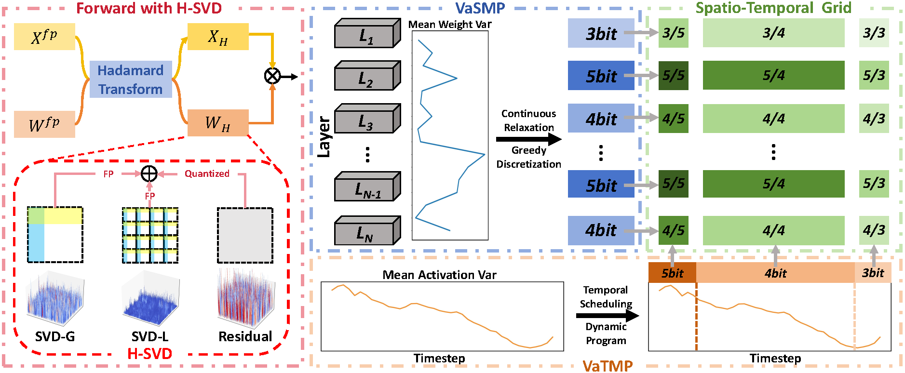
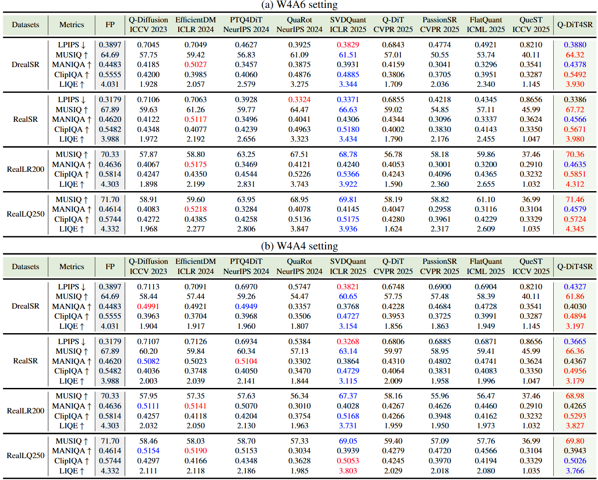
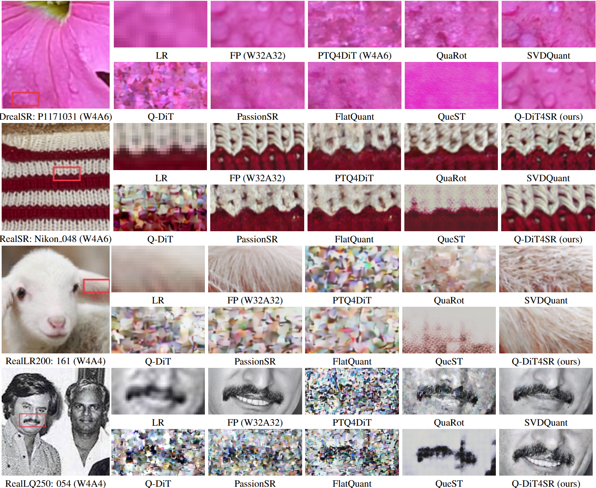

# 🚀 Q-DiT4SR: Exploration of Detail-Preserving Diffusion Transformer  Quantization for Real-World Image Super-Resolution
[Xun Zhang](https://xunzhang1128.github.io/), [Kaicheng Yang](https://github.com/racoonykc), [Hongliang Lu](https://github.com/Lukebird17), [Haotong Qin](https://github.com/htqin), [Yong Guo](https://github.com/guoyongcs) and [Yulun Zhang](https://github.com/yulunzhang).

[arXiv] [[supplementary material](https://github.com/xunzhang1128/Q-DiT4SR/releases/download/v1/Supplementary_Material.pdf)]

#### 🔥🔥🔥 News

- [**2026-01-31**] Repository initial release.

---

## 📘 Abstract

> Recently, Diffusion Transformers (DiTs) have emerged in Real-World Image Super-Resolution (Real-ISR) to generate high-quality textures, yet their heavy inference burden hinders real-world deployment. While Post-Training Quantization (PTQ) is a promising solution for acceleration, existing methods in super-resolution mostly focus on U-Net architectures, whereas generic DiT quantization is typically designed for text-to-image tasks. Directly applying these methods to DiT-based super-resolution models leads to severe degradation of local textures. Therefore, we propose **Q-DiT4SR**, the first PTQ framework specifically tailored for DiT-based Real-ISR. We propose **H-SVD**, a hierarchical SVD that integrates a global low-rank branch with a local block-wise rank-1 branch under a matched parameter budget. We further propose **V**ariance-**a**ware **S**patio-**T**emporal **M**ixed Precision: **VaSMP** allocates cross-layer weight bit-widths in a data-free manner based on rate-distortion theory, while **VaTMP** schedules intra-layer activation precision across diffusion timesteps via dynamic programming (DP) with minimal calibration. Experiments on multiple real-world datasets demonstrate that our Q-DiT4SR achieves SOTA performance under both **W4A6** and **W4A4** settings. Notably, the W4A4 quantization configuration reduces model size by **5.8**$\times$ and computational operations by over **60**$\times$.

---

## 📝 Overview

---

## 🔖 TODO

- [ ] Release model checkpoints.
- [ ] Release quantization and inference code.
- [ ] Release calibration set.

---

## 🔎 Results

We achieve SOTA Real-ISR performance on both W4A6 and W4A4 settings based on DiT backbones.

Quantitative Results (click to expand)

- Results in Tab. 1 of the main paper

  

Qualitative Results (click to expand)

- Results in Fig. 6 of the main paper

  

---

## 💡 Acknowledgements

We thank the developers of [DiT4SR](https://github.com/Adam-duan/DiT4SR) for their open-source contributions, which have greatly facilitated our research.
